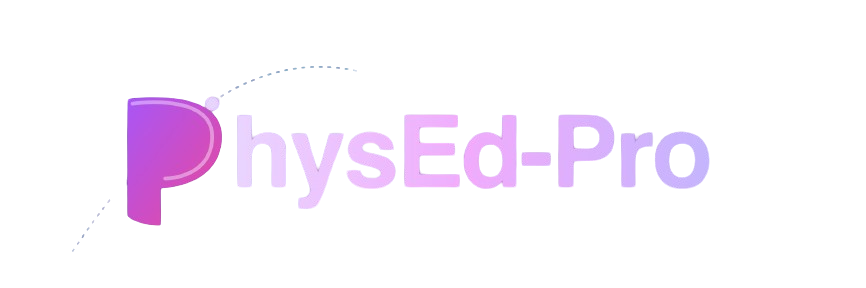

# PhysEd-Pro

**PhysEd-Pro** is a comprehensive exam preparation platform for CBSE Class XII Physical Education. It provides a structured archive of board exam questions, sample papers, and chapter-wise study materials to help students excel in their examinations.



## 🚀 Features

- **Chapter-wise Practice**: Study questions organized by chapters according to the latest CBSE syllabus.
- **Yearly Archives**: Access board exam papers from 2022 to 2025, including compartment exams.
- **Interactive Test Mode**: Practice with a built-in timer, question palette, and instant answer verification.
- **Bookmarks**: Save important questions for quick revision later.
- **PDF Resources**: Download NCERT textbooks, Sample Question Papers (SQP), and official board papers.
- **Modern UI/UX**: Clean, responsive design with dark mode support and smooth animations.

## 🛠️ Tech Stack

- **Framework**: [Next.js](https://nextjs.org/) (App Router)
- **Styling**: [Tailwind CSS](https://tailwindcss.com/)
- **Animations**: [Framer Motion](https://www.framer.com/motion/)
- **Search**: [Fuse.js](https://www.fusejs.io/)
- **PDF Generation**: [jsPDF](https://github.com/parallax/jsPDF)
- **Icons**: Lucide React

## 📦 Getting Started

### Prerequisites

- Node.js 18+ 
- npm / yarn / pnpm

### Installation

1. **Clone the repository**:
   ```bash
   git clone https://github.com/your-username/PhysEd-Pro.git
   cd PhysEd-Pro
   ```

2. **Install dependencies**:
   ```bash
   npm install
   ```

3. **Run the development server**:
   ```bash
   npm run dev
   ```

4. **Build for production**:
   ```bash
   npm run build
   ```

## 📂 Project Structure

- `src/app`: Next.js App Router pages and layouts.
- `src/components`: Reusable UI components.
- `src/data`: Question database and chapter information.
- `public`: Static assets including PDFs and images.

## 🤝 Contributing

Contributions are welcome! Please check the [CONTRIBUTING.md](CONTRIBUTING.md) for details.

## 📄 License

This project is licensed under the MIT License - see the [LICENSE](LICENSE) file for details.

---

Built with ❤️ for Physical Education students.


# Initial release of PhysEd-Pro
  